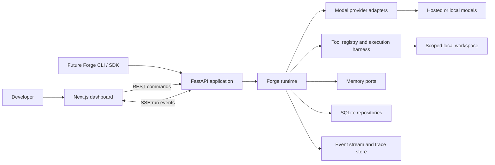
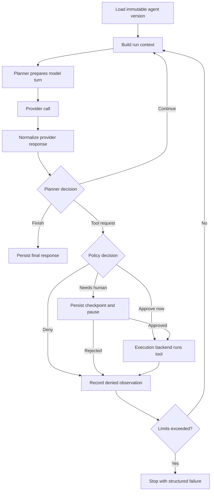

# Forge Architecture

## Document status

This document turns the product vision in `scope.md` into a concrete, local-first
architecture. It is the proposed design for the first useful versions of Forge
and should evolve through small architecture decisions as we learn from using
the platform.

Where the earlier stack or repository suggestions in `scope.md` differ from
this document, this document is the current implementation direction. The scope
remains the product vision; this architecture describes how we will build it.

Forge is an AI agent runtime and engineering platform. It is not the agent
itself. Agents are applications that execute on Forge.

## Product objective

Forge should let a developer create, run, inspect, and improve many kinds of AI
agents without changing the runtime. The platform must make the mechanics of an
agent understandable:

- what context the model received;
- what the model returned;
- why the runtime took the next action;
- which tool was requested and whether it was permitted;
- how state and memory changed;
- how long each step took and what it cost;
- where a run failed and whether it can resume.

The first real deployment target is a Raspberry Pi running Forge continuously
as a personal agent platform. That target keeps the design resource-conscious,
local-first, and useful enough to dogfood.

## Architectural principles

1. **The runtime is the only execution path.** Models, tools, memory, and
   workflows do not bypass it.
2. **Build the concepts; reuse infrastructure.** Forge implements runtime and
   orchestration behavior, while using FastAPI, SQLite, SQLAlchemy, provider
   SDKs, and OpenTelemetry where appropriate.
3. **Start as a modular monolith.** Module boundaries matter from day one, but
   independent services do not.
4. **Async at the boundaries.** Model calls, tool execution, event streaming,
   and future workflow branches are asynchronous. Pure domain logic stays
   synchronous when possible.
5. **Events explain the system.** Every meaningful transition produces a typed,
   persisted event.
6. **Safe by default.** Tools declare capabilities and the runtime checks policy
   before execution.
7. **Configuration selects implementations.** Providers, planners, memory
   stores, and execution backends are replaceable through interfaces.
8. **SQLite first.** Redis, PostgreSQL, distributed workers, and containers are
   introduced only when a measured need appears.
9. **A run is reproducible.** Each run refers to an immutable snapshot of the
   agent configuration that produced it.
10. **Forge exposes complexity instead of hiding it.** Abstractions should make
    behavior inspectable, not magical.

## Initial scope

The first useful Forge version will support:

- locally stored agent definitions and immutable versions;
- one real model-provider adapter plus a deterministic fake provider;
- a basic ReAct-style planner;
- a runtime loop with streaming events, limits, cancellation, and failures;
- a small tool registry with explicit permissions;
- SQLite persistence for definitions, runs, steps, messages, and events;
- a dashboard for creating agents and inspecting live and historical runs;
- a single-process local deployment suitable for a laptop or Raspberry Pi.

The following are intentionally deferred:

- multi-user accounts and organizations;
- distributed execution and worker fleets;
- Kubernetes and microVM orchestration;
- a visual workflow editor;
- vector databases and elaborate long-term memory;
- a public plugin marketplace;
- multi-agent coordination;
- production billing or SaaS features.

## User experience

### Primary user

The initial user is the developer operating Forge locally. They are both agent
author and platform operator. Multi-user UX can be added later without shaping
the first architecture around tenancy and permissions that do not yet exist.

### Core journey

1. The user creates an agent and chooses its model, instructions, planner,
   tools, and limits.
2. Saving creates an immutable agent version.
3. The user starts a run with an input and optionally chooses a workspace.
4. The run page streams model, planner, tool, policy, and memory events.
5. A sensitive tool pauses the run and asks for approval.
6. The user can cancel the run or allow it to continue.
7. The final result and complete trace remain available after completion.
8. The user changes the agent, creates a new version, and compares later runs.

### Information architecture

The early dashboard should have five primary areas:

| Area | Purpose |
| --- | --- |
| Dashboard | Runtime health, recent runs, failures, and quick actions |
| Agents | Create, configure, version, and launch agents |
| Runs | Browse live and historical executions |
| Tools | Inspect registered tools, capabilities, and default policies |
| Settings | Configure providers, local paths, limits, and runtime behavior |

Workflows and Evaluations become navigation areas only when their underlying
engines exist. Empty future-product screens should not be built.

### Agent editor

The agent editor should use understandable sections rather than expose a large
JSON document:

- identity: name and description;
- behavior: system instructions and planner;
- model: provider, model, temperature, and output limits;
- capabilities: enabled tools and permission policy;
- memory: selected memory strategy;
- execution: maximum steps, timeout, retries, and budget.

An advanced read-only configuration preview can show the exact serialized agent
definition. Direct JSON editing can be added later.

### Run detail experience

The run page is Forge's most important screen. It should contain:

- a compact header with agent version, status, elapsed time, tokens, and cost;
- the user input and final output;
- a live chronological event timeline;
- expandable step details showing model input/output and planner decisions;
- tool requests, policy decisions, arguments, output, duration, and errors;
- approval controls when a run is paused;
- artifacts created by the run;
- a debug panel for raw event payloads.

The default view should be understandable. Raw payloads remain available for
learning and debugging but should not dominate the screen.

### UX principles

- Show state explicitly: queued, running, waiting for approval, completed,
  failed, cancelled, or interrupted.
- Do not display a run as live unless it is actually connected to the runtime.
- Pair every error with the failed step and a useful reason.
- Require confirmation for sensitive capabilities at the moment of use.
- Preserve the trace even when execution fails.
- Keep provider and tool jargon in expandable technical detail.
- Make the safest path the easiest path.

## System context



## Deployment shape

Forge begins as two local processes and one database file:

```text
Browser
  -> Next.js dashboard :3000
       -> FastAPI service :8000
            -> in-process Forge runtime
            -> SQLite database
            -> per-run local workspaces
            -> external model APIs or a local model server
```

On the Raspberry Pi, systemd will supervise the API and web processes. SQLite
and run workspaces will live under a configurable Forge data directory. A
reverse proxy or private tunnel can be added for remote access, but public
internet exposure is not part of the first deployment.

## Backend architecture

### Modular monolith

The backend is one installable Python application with explicit internal
layers:

```text
HTTP API
  -> application services
       -> runtime and domain
            -> ports (interfaces)
                 <- adapters (SQLite, providers, tools, execution)
```

Dependency rules:

- `domain` contains data types, states, and invariants and imports no framework.
- `runtime` coordinates agent execution using domain types and ports.
- `application` implements use cases such as create-agent and start-run.
- `ports` define protocols for providers, storage, events, memory, and tools.
- `adapters` implement those protocols using infrastructure libraries.
- `api` translates HTTP requests and streaming connections into application
  commands. It must not contain runtime behavior.

### Proposed backend layout

```text
backend/
  pyproject.toml
  src/forge/
    api/
      routes/
      dependencies.py
      app.py
    application/
      agents.py
      runs.py
      approvals.py
    domain/
      agents.py
      runs.py
      events.py
      tools.py
    runtime/
      engine.py
      state.py
      limits.py
    planners/
      base.py
      react.py
    ports/
      providers.py
      repositories.py
      events.py
      memory.py
      execution.py
    adapters/
      providers/
      sqlite/
      tools/
      execution/
    config.py
  tests/
    unit/
    integration/
```

This is a target structure, not a requirement to create empty modules. Folders
should be introduced with the first behavior that needs them.

## Core domain model

### AgentDefinition and AgentVersion

`AgentDefinition` owns a stable identity and human-facing metadata.
`AgentVersion` is an immutable executable configuration containing:

- instructions;
- provider and model configuration references;
- planner configuration;
- enabled tools and policies;
- memory configuration;
- execution limits.

Editing an agent creates a new version. A run always points to the exact version
used, so historical traces remain explainable.

### Run

A `Run` represents one execution request. Its state is one of:

```text
queued -> running -> completed
                  -> failed
                  -> cancelled
                  -> interrupted
                  -> waiting_for_approval -> running
```

Terminal states are `completed`, `failed`, `cancelled`, and `interrupted`.
State transitions are validated centrally rather than assigned freely by API
handlers or tools.

### Step

A run contains ordered steps. A step is a meaningful unit of work such as:

- model request;
- planner decision;
- tool execution;
- memory read or write;
- approval request;
- final response.

Steps contain structured input, output, timing, status, attempt count, and error
details. Large binary output is stored as an artifact and referenced by ID.

### Event

Events form the append-only execution trace. Each event contains:

- event ID and schema version;
- run ID and optional step ID;
- event type;
- monotonic sequence number within the run;
- timestamp;
- typed payload;
- correlation and causation IDs.

Events explain what occurred, while normalized tables hold queryable current
state. Forge will not begin as a fully event-sourced system.

## Runtime design

### Runtime responsibility

The runtime owns:

- loading and validating an agent version;
- creating run state and enforcing transitions;
- building planner context;
- invoking model providers;
- validating and authorizing tool requests;
- executing tools through an execution backend;
- recording observations and memory updates;
- enforcing step, time, token, and cost limits;
- emitting events before and after meaningful actions;
- producing a final result or structured failure.

### Execution loop



The runtime persists state and emits an event around each external boundary.
If a process exits, the stored state must make the interruption visible. Durable
mid-step recovery will be added later; early versions mark abandoned running
runs as interrupted on startup.

### Planner contract

Planning and execution remain separate. A planner:

- prepares the next model input from run state;
- interprets normalized model output;
- returns a typed decision such as `ToolAction`, `ContinueAction`, or
  `FinalAction`.

The planner never executes a tool, writes directly to memory, or changes run
status. The runtime applies its decision.

### Provider contract

The Phase 3 implementation uses normalized text messages, text/tool-call content
blocks, deltas, usage, finish reasons, request IDs, latency, and allowlisted
provider metadata. Gemini uses the official async SDK; the fake adapter shares
the same streaming contract. The runtime persists bounded coalesced deltas for
existing committed SSE replay and retains the final normalized result. ReAct
supports continue/finish turns with chronological context. Phase 4 advertises
only enabled versioned tool schemas, authorizes each request through policy,
and feeds structured observations back into the next model turn. Immutable version budgets include steps,
duration, output tokens, retries, total tokens, and user-priced estimated cost.
Missing usage stays unknown and enabled budgets fail closed. Cost is checked
after each response, not a hard billing guarantee. See
`docs/decisions/0005-bounded-streaming-planner.md` for the implemented tradeoffs
and the distinction between offline SDK verification and live acceptance.

Provider adapters normalize vendor-specific behavior into one Forge contract:

- messages and roles;
- text and structured content blocks;
- tool definitions and tool calls;
- streaming deltas;
- finish reason;
- token usage, latency, and provider request ID;
- normalized provider errors.

Secrets are referenced by provider configuration and loaded from environment or
a local secret source. Raw credentials are never stored in events or ordinary
SQLite columns.

### Memory contract

Memory is split by purpose rather than treated as a single embedding store:

- run context: ephemeral state for the current execution;
- conversation memory: messages belonging to a thread;
- working memory: explicit notes or facts for the current task;
- long-term memory: optional retrieval across runs.

The first implementation provides run context and conversation memory using
SQLite. Semantic retrieval and vector storage remain optional adapters.

## Tool system and controlled execution

### Tool contract

Every tool provides:

- a stable name and version;
- human-readable purpose;
- Pydantic input and output schemas;
- declared capabilities;
- risk classification;
- timeout and output limits;
- an async execution method receiving a scoped `ToolContext`.

`ToolContext` contains only the run-scoped resources the tool is allowed to
use. It does not expose the whole application container.

### Policy checks

Before every invocation, the policy engine considers:

- whether the agent version enables the tool;
- requested capability and risk level;
- workspace and path scope;
- network access policy;
- command or operation allow/deny rules;
- whether human approval is required;
- per-run call and budget limits.

The decision and reason are persisted whether access is allowed, denied, or
paused for approval.

### Execution backends

The tool interface is independent from isolation. Execution backends will be
introduced in stages:

1. **In-process tools** for pure, low-risk operations such as calculation.
2. **Restricted local process** for commands with explicit working directory,
   sanitized environment, timeout, output cap, and cancellation.
3. **Container backend** for stronger filesystem and network isolation.
4. **Future remote sandbox** only if a real distributed need emerges.

Path allowlists and subprocess controls reduce accidents but are not a security
boundary. Forge must communicate that limitation clearly until container or
stronger isolation is active.

### Workspace model

Each run receives a workspace root. Filesystem tools resolve paths against that
root, reject traversal outside it, and record changed files as events or
artifacts. The runtime data directory and application source are not implicitly
writable by an agent.

The implemented Phase 4 registry enables exact `name@version` tokens. Calculator,
current time, and workspace reads allow; workspace writes and subprocess require
durable approval. Subprocess also requires an operator-owned, default-empty
exact argv allowlist. Approval checkpoints retain conversation, call batch,
accounting, and remaining execution time. Waiting/downtime does not consume that
budget. Committed decisions resume on restart only before dispatch; uncertain
started effects are interrupted rather than replayed. Descriptor-relative
`O_NOFOLLOW` filesystem operations reduce path substitution races but do not
provide isolation from hostile local processes. Artifacts reference mutable
workspace files. Migration rollback refuses active approvals/checkpoints.
See `docs/decisions/0006-controlled-tools.md` for the limits of these guarantees.

The root `./forge` operator CLI manages setup, foreground/background development
startup, readiness, status, logs, restart, stop, and verification for both local
services. It is not a new execution host or the future public agent SDK CLI;
Docker and production supervision remain separate later work.

## Persistence

SQLite is the initial durable store, accessed through SQLAlchemy repositories
and versioned migrations. WAL mode and short transactions keep the local UI and
runtime responsive. The runtime should not depend on SQLite-specific types so a
PostgreSQL adapter remains possible later.

Initial tables:

| Table | Responsibility |
| --- | --- |
| `agents` | Stable agent identity and metadata |
| `agent_versions` | Immutable serialized executable definitions |
| `runs` | Run status, inputs, result, limits, and agent-version reference |
| `steps` | Ordered model, planner, tool, memory, and approval operations |
| `messages` | Conversation and model messages |
| `events` | Append-only typed execution trace |
| `tool_executions` | Tool request, policy decision, output, timing, and error |
| `approvals` | Pending and resolved human decisions |
| `artifacts` | Metadata and paths for files produced by runs |

Schema rules:

- IDs are sortable application-generated identifiers.
- Timestamps are stored in UTC.
- JSON payloads have an explicit schema version.
- Run event sequence numbers are unique and strictly increasing per run.
- Provider secrets are not stored in these tables.
- Deleting an agent does not destroy historical run data; early versions use
  archival flags rather than hard deletion.

## Events and observability

The first event bus is an in-process publisher backed by a persistent event
repository. A runtime action writes its state change and corresponding event in
one transaction where possible, then publishes the committed event to local
subscribers.

In the Phase 1 foundation, the API returns a server-generated `X-Request-ID`
for each request and persists that value in the `run.created` event payload.
The event's `run_id` connects the creation request to its durable trace. Full
correlation and causation fields across runtime operations remain Phase 5 work
(see `docs/decisions/0002-request-correlation.md`).

Example event families:

- `run.created`, `run.started`, `run.completed`, `run.failed`;
- `model.requested`, `model.delta`, `model.completed`, `model.failed`;
- `planner.decided`;
- `tool.requested`, `tool.authorized`, `tool.started`, `tool.completed`,
  `tool.failed`;
- `approval.requested`, `approval.resolved`;
- `memory.read`, `memory.written`;
- `limit.warning`, `limit.exceeded`.

Structured logs and OpenTelemetry spans should use the same run and step IDs.
Streaming model tokens may be sent live without persisting every token as a
separate row; the completed model response is always persisted.

## API design

FastAPI exposes versioned REST commands and Server-Sent Events (SSE). SSE is
preferred over WebSockets initially because live run updates are primarily
server-to-client and reconnection is simpler.

Initial endpoint families:

```text
GET    /api/v1/health
GET    /api/v1/agents
POST   /api/v1/agents
GET    /api/v1/agents/{agent_id}
POST   /api/v1/agents/{agent_id}/versions
POST   /api/v1/runs
GET    /api/v1/runs
GET    /api/v1/runs/{run_id}
POST   /api/v1/runs/{run_id}/cancel
GET    /api/v1/runs/{run_id}/events
GET    /api/v1/runs/{run_id}/stream
POST   /api/v1/approvals/{approval_id}/resolve
GET    /api/v1/tools
GET    /api/v1/providers
```

Command endpoints return the accepted resource and status rather than holding a
connection open for an entire agent run. SSE clients reconnect using the last
received event sequence.

## Frontend architecture

The Next.js application uses the App Router, TypeScript, Tailwind CSS, and
Shadcn UI. It is an operator dashboard, not the execution host.

Proposed feature-oriented layout:

```text
frontend/src/
  app/
    agents/
    runs/
    tools/
    settings/
  components/
    ui/
    layout/
  features/
    agents/
    runs/
    approvals/
  lib/
    api/
    events/
    formatting/
```

Frontend rules:

- Server Components render stable page shells and initial reads where useful.
- Client Components own forms, filters, and live SSE state.
- FastAPI remains the source of truth; the frontend does not implement a second
  domain API.
- API types are generated from OpenAPI once contracts stabilize. Handwritten
  types are acceptable for the first vertical slice.
- URLs identify the selected agent and run so views remain shareable.
- Loading, empty, disconnected, and failed states are first-class UI states.

## Process supervision and scheduling

The API process initially supervises active runs with an in-memory task
registry. Run state is persisted before work begins. On startup, the supervisor
marks abandoned running work as interrupted and emits recovery events.

Scheduling arrives later as a trigger that creates normal runs. Scheduled runs
must pass through the same runtime, policy, event, and persistence paths as
interactive runs.

For Raspberry Pi deployment:

- systemd starts and restarts the API and dashboard;
- SQLite backups use a safe online backup process;
- logs use structured stdout/stderr and system journal rotation;
- workspace and database locations are configurable;
- health endpoints support local monitoring;
- resource limits are conservative by default.

## Testing strategy

- Unit tests cover domain transitions, planners, policies, limits, and event
  payloads.
- Contract tests run every provider and tool adapter against shared behavior.
- Integration tests use temporary SQLite databases and fake providers.
- API tests verify commands, validation, SSE replay, and error contracts.
- One end-to-end test exercises create-agent -> start-run -> tool -> final
  response -> inspect-trace.
- Real-provider tests are opt-in and never required for the default suite.

Deterministic fake providers and tools are essential: they let us test runtime
behavior without network access, cost, or nondeterministic model output.

## Architecture decision policy

Significant decisions should be recorded under `docs/decisions/` when they are
made. An architecture decision should describe context, the choice, alternatives,
and consequences. Early decisions expected to need records include:

- the runtime language (`0001-python-runtime.md`);

- runtime concurrency and cancellation model;
- database and migration library;
- provider response normalization;
- tool capability and approval model;
- event persistence and delivery guarantees;
- local-process versus container execution.

## Questions to resolve during implementation

These choices are intentionally deferred until the relevant phase:

- Which real provider should be the first reference adapter?
- Which tool actions require approval by default?
- Should provider credentials begin as environment-only configuration or use a
  local encrypted secret store?
- What is the first Home Agent workflow worth running continuously?
- When does local process isolation become insufficient for actual dogfooding?

The implementation plan in `plan.md` answers when each question must be decided,
so we do not block the foundational work prematurely.
