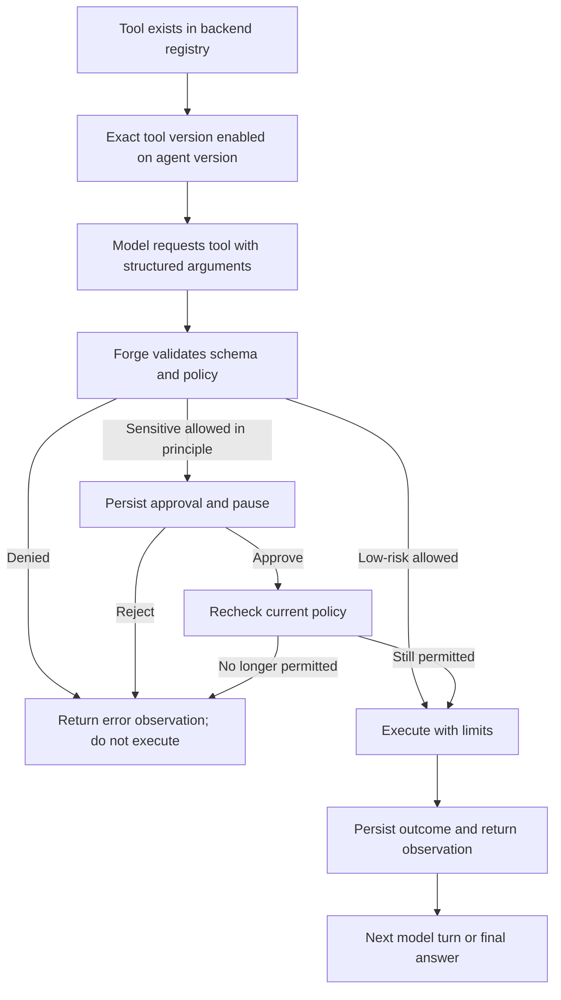

# Forge: how agents, tools, and runs actually work

> Start here if the dashboard feels confusing.
>
> This guide describes the implemented Phase 4 tools and Phase 5 observability,
> not the future product.
> Read sections 1–6 to use Forge. Read sections 7–10 to understand or extend it.

## 1. First: why does the UX feel confusing?

The current UI is an **engineering/operator dashboard**, not a polished chat app.
It exposes internal concepts before clearly explaining them.

In particular:

- **Create agent** saves configuration. It does not start a task.
- **Launch run** creates a task and starts it.
- **Queue run** creates a task but does not start it yet.
- **Tools** shows installed capabilities. It does not let you build a tool.
- **Enable a tool** permits requests for it. It does not invoke it immediately.
- **Approve** authorizes one pending call, not every future call from that agent.
- A **fake** provider is a test simulator, not an intelligent model.
- A new **version** preserves old configurations; it is not an edit-in-place.

The UI now explains these distinctions alongside configuration and task forms.
It also identifies the fake simulator, shows a scripted example for fake agents,
and explains that the tool catalog is read-only. It remains an operator dashboard,
not a conversational product.

**The ordinary journey should be understood as:**

```text
Choose what the agent can do
        ↓
Save its configuration
        ↓
Give it a task
        ↓
Watch execution; approve sensitive calls if requested
        ↓
Read the answer and download any files
```

You do not need to understand database tables or raw events to use that flow.

## 2. The mental model: six different things

| Concept | Plain English | Example |
| --- | --- | --- |
| Forge | The system that runs and controls agents | Backend, dashboard, storage, execution |
| Agent | A named reusable configuration | “Report Writer” |
| Agent version | A saved, immutable configuration of that agent | Report Writer v1 with calculator + file write |
| Provider/model | The thing generating responses and requesting actions | Gemini; fake is only a simulator |
| Tool | Actual backend code that performs an operation | Write a workspace file |
| Run | One task executed using one saved version | “Calculate this and save the result” |

An agent also has **instructions**, a **planner**, and **limits**.

- Instructions describe its ongoing behavior.
- The task input describes what you want on this particular run.
- The planner interprets model responses as finish, continue, or tool actions.
- Limits bound execution and accounting.

### Important: creating an agent does not train a model

You are saving instructions, model selection, enabled tools, and limits.
You are not creating model weights, fine-tuning, installing a program, or starting
a continuously running worker.

### Important: the model is not the executor

The model can request something like:

```json
{"name":"filesystem_write","arguments":{"path":"answer.txt","content":"some result"}}
```

Forge—not the model—checks the request, asks for approval when needed, executes
backend code, and records the outcome.

## 3. What each dashboard page is for

| Page | Use it for | It does not do |
| --- | --- | --- |
| Dashboard | Check API health and get an overview | Execute agent work itself |
| Agents | Create configuration, save new versions, launch tasks | Author Python tools or train models |
| Runs | Browse tasks; queue a task for an agent | Automatically start a newly queued task |
| Run details | Start a queued task, follow progress, approve/reject, cancel, inspect results | Turn old completed runs into new conversations |
| Tools | Inspect available names, versions, schemas, risks, and limits | Create/install tools or grant agent access by itself |

The dashboard talks to FastAPI. FastAPI accepts commands. The **backend runtime**
owns execution. Closing the tab does not cancel the task.

## 4. Your first run: use the offline demo before Gemini

This demonstrates the entire tool/approval/file flow without a key or paid call.

### Step A — Start Forge

From the project root:

```bash
./forge setup   # first setup, or when locked dependencies change
./forge dev     # API + dashboard together; Ctrl-C stops both
```

Open the dashboard at `http://localhost:3000`.

Alternatively:

```bash
./forge start
./forge status
./forge logs --service api --follow
./forge stop
```

`start` runs the development services in the background. Docker is not required.
Ordinary startup uses your normal local data. For a separate, no-credentials
smoke environment, supply an isolated absolute data directory and `--offline`.

### Step B — Create an agent

Open **Agents → Create agent**.

Use:

| Field | Value |
| --- | --- |
| Name | Tool Demo |
| Description | Optional; e.g. “Learn tool approvals” |
| Instructions | “Use the enabled tools for the task. Ask for approval before writing files.” |
| Provider | `fake` |
| Model | `deterministic` |
| Enabled tools | Check `calculator@1` and `filesystem_write@1` |
| Maximum steps | Leave at `12` |
| Other limits | Leave the defaults for this demo; optional budgets/pricing blank |

Click **Create agent**.

What just happened?

1. Forge saved a named agent.
2. Forge saved its first executable configuration as version 1.
3. Nothing has run yet.

**The fake provider does not understand those instructions.** We still save them
because fake and real versions use the same configuration shape.

### Step C — Give that agent a task

On its saved card, find **Run Tool Demo**.
Paste this exact input:

```json
{"forge_script":[{"name":"calculator","arguments":{"expression":"2 + 3 * 4"}},{"name":"filesystem_write","arguments":{"path":"answer.txt","content":"14"}}]}
```

Click **Launch run**.

This JSON is a special **fake-provider test script**, not the normal user-facing
language for an intelligent agent. It tells the simulator which requests to
emit. The file content is explicitly supplied by the script; the fake provider
is not reasoning about the calculator result or dynamically constructing it.

### Step D — Understand the pause

The run details page should show **waiting for approval**.

- Calculator is enabled and low-risk, so Forge executes it without a prompt.
- File writing is enabled but sensitive, so Forge persists an approval request.
- The file has not been written by that pending call yet.
- The **Tool approvals** section shows the tool name and exact arguments.

Review the path and content. Click **Approve**.

If you click **Reject**, Forge does not execute that call. It passes a rejected
observation back to the provider. The fake script can still finish; completion
does not mean every requested action was allowed or succeeded.

### Step E — Inspect the result

After approval:

- The run finishes with `Fake tool script completed`.
- **Artifacts** lists `answer.txt`.
- **Download** retrieves the recorded file.
- **Steps** includes model/planner/tool operations.
- **Event timeline** includes the request, policy, approval, outcome, and run completion.

Reload the page: the run, approval decision, and trace are persisted.

### A different route: Queue run

On **Runs**, choosing an agent and clicking **Queue run** only creates a record.
You must then click **Start run** on its detail page.

```text
Agents → Launch run = create + start
Runs   → Queue run  = create only → detail page → Start run
```

This inconsistent starting experience is one reason the UX feels unintuitive.

## 5. Making a real agent rather than a fake demo

A real model can interpret an ordinary-language task and choose tools.

### Provider setup

Gemini credentials belong on the backend, in `backend/.env` or its process
environment, using `GEMINI_API_KEY`. Use `backend/.env.example` as the template.
Restart the API after changing credentials.

**Do not enter keys into agent instructions, the dashboard, a task, or
`NEXT_PUBLIC_*` variables.**

### Agent setup

Create an agent with:

- Provider: `gemini`.
- Model: the configured Gemini model shown by the form; the project's reference
  model is `gemini-3.5-flash-lite`. Account/model availability is checked by the
  provider, not guaranteed by the text field.
- Instructions: persistent behavior, such as:

  > You are a report assistant. Use calculator for arithmetic. Write requested
  > reports only inside the run workspace. If a tool is denied or fails, explain
  > that instead of claiming success. Finish with a short summary and file path.

- Tools: enable only those required, such as `calculator@1` and
  `filesystem_write@1`.
- Limits: leave conservative defaults initially. Increase the step budget only
  when the task needs more model/planner/tool operations.

Then launch a task using natural language, for example:

> Use calculator to evaluate `2 + 3 * 4`, then write the result to `answer.txt`.
> Finish with a short summary.

The intended flow is model → calculator → observation → model → file request →
approval → file result → model → answer. Exact choices are model-dependent.
Enabling a tool does not force the model to use it; a prompt request is not an
execution guarantee.

### Model instructions are not permissions

These are different:

```text
“Please write a file” in instructions  → behavioral request
Checking filesystem_write@1          → permission to request that tool
Approving its pending call            → authorization for that invocation
```

Without the tool enabled, prompt wording cannot grant it access.

### Limits in the form

| Field | What it means |
| --- | --- |
| Maximum steps | Bound on runtime operations; not a count of chat messages |
| Timeout | Execution-time budget; saved remainder survives approval pauses |
| Output tokens / request | Model output cap sent for each request |
| Retries / request | Bound on eligible transient model retries |
| Run token budget | Optional cumulative accounting limit |
| Run cost budget | Optional estimated-cost limit using your explicit rates |
| Input/output USD per million | Your supplied pricing; blank means unknown cost |

Approval waiting and downtime do not consume the saved execution-time budget.
There is no approval-wait expiry in this phase. Token/cost budgets are checked
after responses, so they are not a provider-side hard billing cap. Missing usage
fails closed when a budget needs it.

Phase 3 verified a live Gemini no-tool run. Phase 4 verified the tool flow with
fake/browser tests and Google SDK mock-HTTP contracts; a paid live Gemini tool
run was **not** part of that acceptance. An account's key, quota, or model access
can still fail independently.

## 6. How tool access really works

There are multiple gates—not a single checkbox that grants arbitrary host access.



### Installed versus enabled

The backend registry might contain five tools. One agent can enable two, another
can enable none. **Appearing on the Tools page does not grant every agent access.**

The configuration stores exact tokens such as:

```json
{"tools":["calculator@1","filesystem_write@1"]}
```

`@1` identifies the registered tool version. The model-facing request uses a name
such as `calculator`; Forge resolves it against the versioned tools enabled on
that immutable agent configuration. Do not remove the version suffix from the
configuration token.

### Built-in permissions

| Tool token | Input | Current policy |
| --- | --- | --- |
| `calculator@1` | `{"expression":"2 + 3 * 4"}` | Allow if enabled and valid |
| `current_time@1` | `{}` | Allow if enabled; returns UTC time |
| `filesystem_read@1` | `{"path":"notes.txt"}` | Allow if enabled and scoped |
| `filesystem_write@1` | `{"path":"answer.txt","content":"..."}` | Require approval if valid/scoped |
| `subprocess@1` | `{"argv":["/absolute/executable","arg"]}` | Exact operator allowlist **and** approval |

The current policy is built into backend code. There is not yet a dashboard
policy editor for per-agent path scopes, network rules, or custom approval rules.

### Filesystem scope

By default, files belong under:

```text
backend/data/workspaces/<run_id>/
```

With a custom `FORGE_DATA_DIR`, they belong under that directory's
`workspaces/<run_id>/` instead.

`answer.txt` means **inside this run's workspace**, not the repository root,
Desktop, home directory, or another run's workspace. Absolute paths, `..`,
symlinks, and unsafe file types/links are rejected by the local controls.

Each run has a separate workspace. Enabling file read does not automatically
mount your project or import files. There is no upload/mount picker in this UI.
An operator can prepopulate a known queued run's workspace before starting it;
that is a manual setup step, not an automatic agent capability.

### Subprocess is deliberately harder to enable

Checking `subprocess@1` is **not enough**. The backend setting
`FORGE_SUBPROCESS_ALLOWLIST` defaults to an empty list.

The operator must configure a JSON array of **exact argv arrays**, including an
absolute executable path. Different arguments are a different command. The call
must then receive approval. This is not a free-form terminal tool and does not
use shell expansion.

Do not casually allowlist a shell or interpreter. An approved program still runs
with the API process's host permissions. Sanitized environment, workspace cwd,
timeout, and output limits reduce accidents; they do not create a sandbox.

### What approval means

Approval belongs to **one recorded call with specific arguments**.
It survives API restart. Duplicate/conflicting resolution cannot execute it
a second time through the approval-resolution path.

A crash during an already-started side effect is different: Forge records an
interrupted/uncertain outcome rather than promising exactly-once execution or
silently replaying the action.

**Local controls are not a security boundary against malicious approved code
or hostile concurrent host processes. Docker/isolation remains deferred.**

## 7. Changing an agent: why versions exist

Suppose v1 enables calculator only. Later you want file writing.

1. Open **Agents**.
2. Expand **Create new immutable version** on the agent card.
3. Check `filesystem_write@1` and adjust instructions if needed.
4. Click **Save new version**.
5. Launch the next task. The normal UI uses the latest version.

```text
Report Writer
├── v1: calculator only
│   └── Run A keeps this configuration forever
└── v2: calculator + file write
    └── Run B uses the new configuration
```

Saving v2 does not modify Run A. It also does not upgrade a run already queued
against v1. This is intentional: historical behavior must remain explainable.

The API can explicitly select an `agent_version_id` when creating a run. The
ordinary UI does not offer a historical-version launch selector yet.

## 8. How do we make a new tool?

**Today, tools are written in Python by a developer. The Tools screen is read-only.**
There is no “New tool” form, uploaded-tool script execution, MCP importer, or
external plugin loader in the implemented Phase 4 flow.

### A tool is more than a Python function

It has both executable code and a machine-readable contract:

| Part | Why it exists |
| --- | --- |
| Stable name + version | Identify the exact capability |
| Description | Tell the model/operator when to use it |
| Input model | Validate the requested arguments |
| Output model | Normalize the observation returned to the model |
| Capabilities | Describe the resources/actions involved |
| Risk | Decide whether the current policy requests approval |
| Timeout/output cap | Bound execution and stored output |
| Async execute method | Perform the operation with a scoped context |

The current `ToolContext` supplies a run ID, workspace, and subprocess allowlist.
It does not hand a tool the whole application container or a database session.

### Follow a real example already in the repository

Read these files in this order:

1. `backend/src/forge/domain/tools.py` — typed contracts and built-in input/output models.
2. `backend/src/forge/runtime/tools.py` — implementations and `ToolRegistry`.
3. `backend/src/forge/runtime/policy.py` — authorization rules.
4. `backend/src/forge/runtime/tool_execution.py` — approval, execution, observations, events.

The existing calculator input is effectively:

```python
class CalculatorInput(ToolInput):
    expression: str = Field(min_length=1, max_length=256)
```

The existing calculator implementation declares:

```python
name = 'calculator'
version = '1'
input_model = CalculatorInput
output_model = CalculatorOutput
capabilities = ('calculate',)
risk = 'low'
timeout_seconds = 1.0
max_output_bytes = 4096
```

Its execution method accepts validated arguments and the run context, then
returns a `CalculatorOutput`. It evaluates a small allowlisted arithmetic AST;
it does not run arbitrary Python `eval`.

These are explanatory excerpts from existing code, **not a new tool added by
this guide**.

### Developer workflow for a new tool

For example, if we later add a low-risk text transformation:

1. **Define behavior and safety first.** Decide what resources it needs and what
   must be rejected. Write a failing unit/contract test.
2. **Define Pydantic input/output schemas.** Use bounded fields; the existing
   `ToolInput` rejects unexpected fields.
3. **Implement the async method and metadata.** Match the actual Tool protocol.
   Blocking code must not monopolize the event loop; an async timeout cannot
   preempt arbitrary CPU-bound work.
4. **Register the instance explicitly.** Add it to the default built-in list in
   `ToolRegistry`, or supply it in a registry used by tests. Duplicate name/version
   registrations fail. A custom registry in a unit test does not install a tool
   into the running API.
5. **Review policy.** Current generic authorization uses enabled tokens, typed
   inputs, and risk; filesystem/subprocess have additional checks. Declaring a new
   capability string does **not** automatically implement network/permission
   enforcement. Add actual checks for any new resource boundary.
6. **Test through the runtime.** Cover enabled/disabled requests, invalid input,
   approval where appropriate, failures, time/output limits, observations, and
   trace records—not just the standalone function.
7. **Restart the API after installation.** The catalog exposes registered schemas.
8. **Enable the exact token on a new agent version.** Existing versions are not
   automatically granted the new tool.
9. **Launch a task and inspect the recorded call/outcome.**

The forms fetch the catalog, so a properly registered generic tool can appear
without hand-writing another checkbox. New tools needing special policy or
artifact behavior need additional backend work: automatic artifact recording is
currently wired specifically to successful `filesystem_write` calls.

There is not yet a public extension SDK. Plugin loading is a later phase; for
now we deliberately modify the built-in backend and test it.

## 9. One task, end to end, behind the UI

For a real model run, the sequence is:

```text
YOU: save an agent configuration
  → backend stores Agent + immutable AgentVersion

YOU: enter task and click Launch run
  → frontend POSTs a run request
  → backend stores queued Run pinned to that version
  → frontend requests start
  → supervisor claims the run

RUNTIME:
  → load the saved instructions/model/tools/limits
  → create the run workspace
  → build the next model request, advertising enabled tool schemas
  → provider returns text or structured tool calls
  → planner/runtime interpret the next action

IF A TOOL IS REQUESTED:
  → validate arguments and authorization
  → deny, allow, or persist approval + checkpoint and pause
  → operator approves/rejects when required
  → recheck policy and execute permitted operation with limits
  → persist result/error, timing, and events
  → add a tool observation to model context
  → ask the model for the next action

WHEN FINISHED:
  → persist completed status and final result
  → show answer, trace, and recorded artifacts
```

The model never directly calls the operating system through the dashboard.
HTTP routes do not perform model/tool work themselves. The runtime is the single
execution path.

### Three things on the run page that look similar

- **Result:** the final answer recorded when the run completes.
- **Step:** one operation's input/output/error/status, e.g. calculator invocation.
- **Event:** a chronological fact, e.g. policy decision or approval resolution.

One step can produce several events. You usually read the result and approval
controls first, then expand steps/events when something goes wrong.

### Reading the inspector

- **Run workspace:** shows `workspaces/<run_id>` under the operator's data
  directory. Artifacts list recorded writes, not every file in that directory.
- **Run summary:** elapsed start-to-finish duration includes approval waits,
  excludes queue time, and stays Unknown until finished with valid timestamps.
  Completed, denied, and failed tool counts are separate; cost can be Unknown.
- **Event timeline:** All, Models, Planner, Tools, Approvals, and Errors filters
  change the view, not execution. Events stay in committed sequence order;
  safe raw payloads remain expandable. The latest 100 appear initially; earlier
  events load into bounded pages (up to 500 plus one pinned expanded event).
- **Run diagnosis:** explains failed/cancelled/interrupted outcomes and a next
  action. When the runtime explicitly identifies a failed step, it is named,
  linked, highlighted, and opened automatically. A denied/failed tool can recover;
  the inspector does not assume it caused a later terminal failure.
- Historical traces without explicit failure references cannot identify an exact
  causal step. The **Causal chain** follows recorded predecessor links, not a
  guess based on the last error. Links open the event or step; missing history
  and cycles are called out rather than hidden. Raw details include correlation,
  causation, trace, and span IDs. Legacy rows need not have these fields.
- **Expired content:** a retention notice means some historical content was
  removed. Execution status and measurements remain; they do not restore output.
  An expired artifact has no download link and its API download returns 410.

### Logs, spans, metrics, and retention

Committed events also produce safe structured JSON logs through `forge.events`.
They contain IDs, event type/outcome, and available duration—not prompts, tool
arguments/results, credentials, or arbitrary tracebacks. Use `./forge logs
--service api --follow` for the operator log; the inspector is the durable trace.

Real OpenTelemetry spans measure model, planner, policy, and tool boundaries.
No telemetry is sent over the network by default. Set
`FORGE_TELEMETRY_CONSOLE_EXPORT=true` before starting the API to print SDK spans
locally. With no exporter, spans are ephemeral; SQLite events still persist.
Approval authorization and later execution use distinct SDK spans, linked by
the same run and tool step. Spans are not reconstructed after restart.

`GET /api/v1/runs/<run_id>/metrics` returns aggregate timing, token usage, cost,
retries, failures, and separate completed/denied/failed tool counts. A denial is
not an execution failure. If any contributing model attempt is unmetered,
cumulative usage/cost stays Unknown rather than treating the missing value as 0.

Retention is **off by default**. These optional positive day counts apply only
to old terminal runs:

| Setting | Content removed |
| --- | --- |
| `FORGE_EVENT_RETENTION_DAYS` | Event payload content; envelopes/diagnostics stay |
| `FORGE_MESSAGE_RETENTION_DAYS` | Run input, step/context/approval content, and duplicated event content |
| `FORGE_ARTIFACT_RETENTION_DAYS` | Safely resolved recorded artifact files; metadata stays |

The configured policy runs at API startup. For a manual preview, from `backend/`:

```bash
uv run python -m forge.application.retention
# Review the counts before removing content:
uv run python -m forge.application.retention --apply
```

The command uses your configured data directory/database. Active and
approval-waiting runs are skipped. Cleanup preserves event IDs, sequence,
causal links, diagnostic fields, metrics, and original timestamps. There is no
automatic periodic cleanup scheduler yet. This is not secure erasure: backups,
external log captures, and immutable agent-version configuration remain outside
the retention policy. Workspace controls are still not an OS sandbox.

See [Phase 5 verification](phase-five-verification.md) for tested guarantees.

### Status cheat sheet

| Status | Meaning | Your next action |
| --- | --- | --- |
| `queued` | Saved, not executing | Start it if intended |
| `running` | Runtime is processing it | Watch or cancel |
| `waiting_for_approval` | Sensitive call is paused | Review and approve/reject, or cancel |
| `completed` | Runtime finished with a final response | Read output; inspect tool results if relevant |
| `failed` | Runtime could not finish normally | Inspect terminal reason and failed steps |
| `cancelled` | Cancellation ended execution | Inspect partial trace; launch a new run if needed |
| `interrupted` | Execution was abandoned/uncertain | Inspect before retrying possible side effects |

A denied/failed tool produces an observation, so the model may recover and the
overall run may still complete. Do not equate a final status with proof that all
side effects happened.

## 10. What this UI cannot do yet

These are not hidden buttons you are missing:

- Train/fine-tune a model.
- Create a Python tool from a browser form.
- Import arbitrary tools/plugins through the current dashboard.
- Provide an unrestricted shell just by checking subprocess.
- Mount an arbitrary host/project directory through a workspace picker.
- Upload source files through the current run form.
- Maintain a user conversation/thread across multiple runs.
- Schedule an always-on agent through the current UI.
- Offer container isolation or guaranteed exactly-once external effects.

The name, description, saved model/instructions, tools, and limits make an agent
**reusable configuration**. Each run is a separate task. Later phases add
conversation, workflows, scheduling, and public extensions.

## 11. Common “why is nothing happening?” cases

| Symptom | Explanation / fix |
| --- | --- |
| I created an agent, but nothing runs | Creation only saves configuration; enter a task and launch |
| I queued a run, but it stays queued | Open details and click Start run |
| I typed a normal task with fake, but it just echoes | Fake is not intelligent; use the scripted demo or Gemini |
| I enabled a tool, but the model didn't use it | Permission is not an invocation; ask explicitly and inspect model output |
| A tool is listed but denied | Check the run's pinned version, not just the current agent card; then inspect policy reason |
| Write is enabled but run pauses | Sensitive calls still need approval |
| Subprocess is enabled but denied | Operator's exact argv allowlist is empty or does not match |
| File read cannot see my repository | Reads are scoped to this run's workspace, not the source tree |
| I edited the agent, but an old run did not change | Runs keep the immutable version selected at creation |
| Cost shows Unknown | Explicit pricing or usage is unavailable; unknown is not zero |
| Form saving is disabled | Tool catalog may be loading/unavailable; check API and use Retry tool catalog |
| Gemini is not configured | Set backend credentials correctly and restart; never paste them into the form |

## 12. Shortest possible summary

> **Create agent = save behavior and permissions.**
>
> **Create version = save a changed configuration without changing history.**
>
> **Launch run = give that configuration one task and start it.**
>
> **Tool = backend code, not a prompt.**
>
> **Enable tool = allow that saved version to request it.**
>
> **Policy + approval = decide whether this particular call executes.**
>
> **Run details = answer, approvals, files, and an inspectable execution record.**

### Further reading

- [README: starting the project](../README.md)
- [Phase 4 API contract](phase-four-api-contract.md)
- [Phase 4 verification](phase-four-verification.md)
- [Controlled-tools decisions and limitations](decisions/0006-controlled-tools.md)
- [Codebase guide for maintainers](codebase-guide.md)
